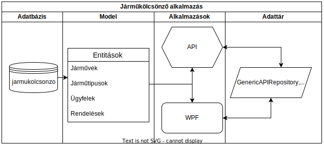

# Járműkölcsönző alkalmazás

Az alkalmazás architektúrális ábrája:

---

## Ügyfelek kezelésének megvalósítása

A feladat célja, hogy megvalósítsa az ügyfelek kezelését a már elkezdett Járműkölcsönző alkalmazásban. A megvalósításban segítségére lesznek a már elkészített járművekre vonatkozó kódsorok.

### API projekt:
* Generáljon egy Controller osztályt a Web API – Entity Framework varázsló segítéségével az ügyfelek táblának! (1 pont)
* Módosítsa az alapértelmezett GET lekérdezés típusát TableDTO-ra. (1 pont)
* Alapértelmezetten az ügyfelek vezetéknév, majd keresztnév alapján legyenek rendezve. (1 pont)
* Valósítsa meg a lapozás, keresés, rendezés műveleteket ugyanezen végponton. (5 pont)

### WPF projekt:
* ViewModel réteg:
    * Az UgyfelekViewModel osztályt örököltesse a PagerViewModel osztályból. (1 pont)
    * Készítsen konstruktort, ami az IPagerRepository példányát várja és eltárolja az osztályban. (1 pont)
    * Valósítsa meg a LoadData metódust, amivel feltölti a megjelenítendő adatokat. (2 pont)
    * Implementálja az IEditCommands interfészt, majd a parancsokhoz készítsen létrehozó, szerkesztő és törlő műveleteket. (3 pont)
* App.xaml.cs
    * Regisztrálja a szükséges szolgáltatásokat a függőségi injektálás megvalósításához. (1 pont)
* Validátorok:
    * Készítsen az ügyfelek beviteli mezőihez egyedi validáló szabályokat. (5 pont)
    * A pont értéken kívül minden ügyfél adat megadása **kötelező**. 
    * *Vezetéknév, keresztnév:* ne tartalmazhasson számot.
    * *Irányítószám:* pozitív 4 számjegyű egész szám.
    * *Telefonszám:* csak ’+’,’-’,’/’ jeleket tartalmazhat és számokat.
    * *Email:* Email cím validálásra példa: [LINK](https://www.abstractapi.com/guides/validate-emails-in-c).
* View réteg:
    * Alakítson ki egy felületet a Járművek menüponthoz hasonlóan. (3 pont)
    * Adatkötéssel kösse össze a XAML elemeket az UgyfelekViewModel értékeivel. (3 pont)
    * A DataGrid elemnél a Sorting műveletet valósítsa meg a kód részben a ViewModel segítségével. (1 pont)

Összesen: 28 pont.
